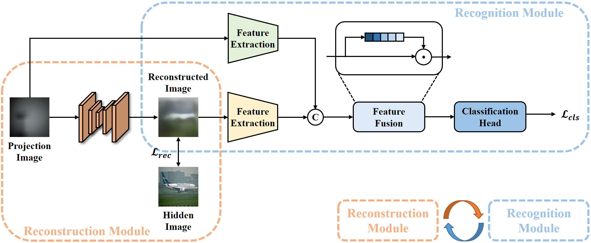

# NLOS-R2

This repository is an official implementation of the paper **"NLOS-R2: Alternate Reconstruction and Recognition for Non-Line-of-Sight Understanding** (ICME 2025)".

In this repository, we release the code in Pytorch as well as the large-scale multi-class passive NLOS dataset.

<br>
<p align="center">

</p>

## Dataset Preparation

1. Download dataset.

You can download the dataset through the link below.

> link: https://pan.baidu.com/s/1nJCdYk56-zuVRTSXmefTnQ  
> password: nsv7

2. Organize the files structure of the dataset.

We recommend organizing the dataset according to the following structure:

```
.
└── NLOS-R2
    └── data
        ├── hq
        │   ├── train
        │   │	├── airplane_x.png
        │   │	├── apple_x.png
        │   │	├── ball_x.png
        │   │	├── bear_x.png
        │   │	├── bed_x.png
        │   │	├── bench_x.png
        │   │	├── bird_x.png
        │   │	├── burger_x.png
        │   │	├── butterfly_x.png
        │   │	├── car_x.png
        │   │	├── cat_x.png
        │   │	├── clock_x.png
        │   │	├── cup_x.png
        │   │	├── dog_x.png
        │   │	├── elephant_x.png
        │   │	├── fox_x.png
        │   │	├── frog_x.png
        │   │	├── horse_x.png
        │   │	├── house_x.png
        │   │	├── koala_x.png
        │   │	├── ladybug_x.png
        │   │	├── monkey_x.png
        │   │	├── motorcycle_x.png
        │   │	├── mushroom_x.png
        │   │	├── panda_x.png
        │   │	├── pen_x.png
        │   │	├── phone_x.png
        │   │	├── piano_x.png
        │   │	├── pizza_x.png
        │   │	├── rabbit_x.png
        │   │	├── shark_x.png
        │   │	├── ship_x.png
        │   │	├── shoe_x.png
        │   │	├── snail_x.png
        │   │	├── snake_x.png
        │   │	├── spaghetti_x.png
        │   │	├── swan_x.png
        │   │	├── table_x.png
        │   │	├── tie_x.png
        │   │	├── tiger_x.png
        │   │	├── train_x.png
        │   │	└── turtle_x.png
        │   ├── val
        │   │	...
        │   └── test
        │   	...
        └── lq
           ├── train
           │   ...
           ├── val
           │   ...
           └── test
               ...
```

## Installation

1. Make a clone of this repository.

```
git clone https://github.com/ustceewy/NLOS-R2.git
cd NLOS-R2
```

2. Set the environment.

```
conda create -n NLOS-R2 python=3.8.18
conda activate NLOS-R2
pip install -r requirements.txt
```

## Traning

We initialize the reconstruction and recognition module from the weights trained on ImageNet-1k.

You can download the pre-trained weight of the reconstruction module through the link below, and it should be located as `experiments/*`.

> https://pan.baidu.com/s/176fARg2ySYtDgX2vQOeRbA?pwd=vfif  
> password: vfif

The Traning command is below:

```
CUDA_VISIBLE_DEVICES=0 python src/main.py --opt options/cls/NLOS-R2.yml
```

## Testing

You can download the pre-trained weights through the link below, and it should be located as `experiments/cls/NLOS-R2/*`.

> link: https://pan.baidu.com/s/1rC6JJab6YeJCT7K1svSuxQ  
> password: wnnt 

The testing command is below:

```
CUDA_VISIBLE_DEVICES=0 python src/main.py --opt options/cls/NLOS-R2.yml --test_only
```

## Citation

If you find our work helpful for your research, please cite our paper.

## Acknowledgement

The idea and code are based on [NLOS-OT](https://github.com/ruixv/NLOS-OT), [SR4IR](https://github.com/JaehaKim97/SR4IR) and [DiffBIR](https://github.com/XPixelGroup/DiffBIR). Thanks for their awesome work.

## Contact
If you have any questions, please email `eewy@mail.ustc.edu.cn`.
